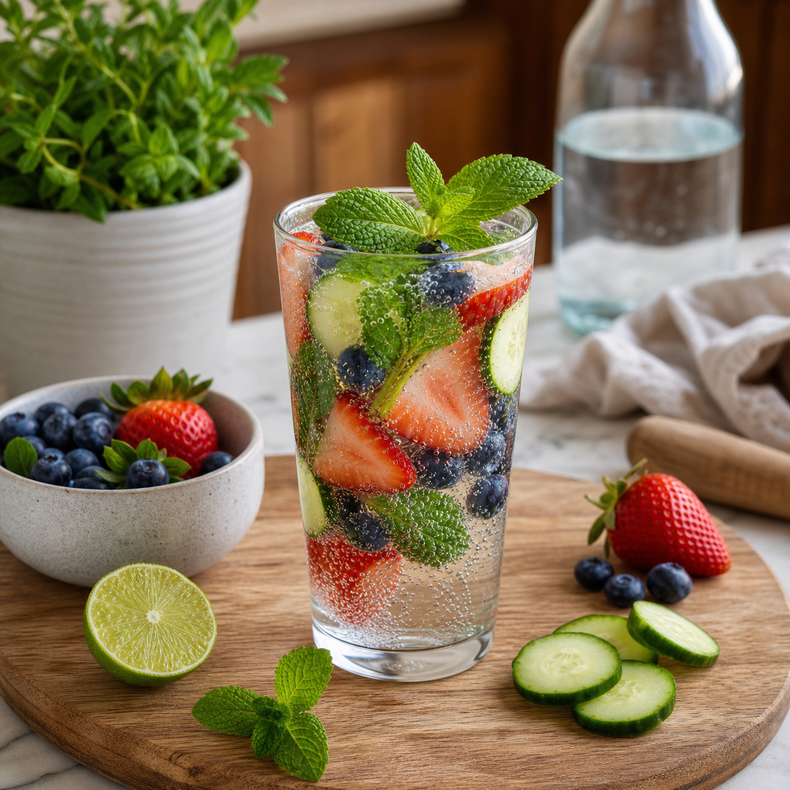

This are mocktails healthy? a practical way to think about it answers a basic question without making the topic feel basic. Clear language matters in alcohol-free drinks, where labels, menus, and social expectations can mean different things to different people. Knowing a few terms makes it easier to order, make, and share drinks with confidence.

### The short answer

A mocktail is typically a mixed drink made without beverage alcohol. It can use fresh fruit, sparkling water, herbs, and an unsweetened mocktail, along with fruit, herbs, tea, spices, syrups, sparkling water, or non-alcoholic alternatives. The word describes a style of preparation and presentation, not a single formula. A good one balances sweetness, acidity, aroma, temperature, and texture in the way a cocktail often would.

### Why the details matter

Some packaged products use terms such as alcohol-free, non-alcoholic, zero-proof, or dealcoholized. These labels are not always identical in every market. Read the product label, check the producer's information, and ask a venue when the distinction matters for your situation. People avoiding alcohol for pregnancy, recovery, religion, medication, or personal reasons may want a more careful check.

### How to use this at home

Start with a simple build: a flavor base, citrus or another balancing element, plenty of cold ice, and a finishing splash of sparkling water or chilled tea. Use a proper glass, even for a weekday drink. The experience becomes more enjoyable when the preparation feels intentional. A small garnish of mint, citrus peel, or fruit can add aroma without adding much sweetness.

### Health context

A mocktail is not automatically low in sugar or suitable for every diet. Juice, syrups, sweet sodas, energy products, and caffeine can change the nutrition profile quickly. Use ingredient labels and serving sizes to make choices that fit your needs. Fruit, unsweetened tea, herbs, and sparkling water offer useful building blocks when you want a lighter direction.

### Frequently asked questions

Is it just juice? Not usually. Juice can be one component, while a mocktail is mixed and balanced like a special drink. Can it be festive? Absolutely. Glassware, ice, aroma, color, and a thoughtful garnish create occasion. Can children drink mocktails? That depends on each ingredient, including caffeine and any product-specific label information. Can I order one at a bar? Many bars now offer alcohol-free mixed drinks; a bartender can often make a simple custom option.

### A confident takeaway

The category is broad enough for a bright brunch drink, a dinner pairing, a warm mug at night, or a celebration toast. Learn the labels, taste as you mix, and treat the drink as a small act of hospitality. That is the useful core of the mocktail idea: more choice at the table, with flavor still at the center.

### Small habits that improve every result

Set up before you mix, shop, or host. Put the items you will use on one clear surface, chill the drink components, and give yourself enough time to taste without rushing. Keep a notebook or phone note with the amount of citrus, sweetness, and dilution that pleased you. Those small records are useful when seasonal fruit changes or a favorite ingredient is unavailable.

### Plan around the people at the table

Offer water alongside any special drink, label pitchers when ingredients matter, and keep a low-sugar or caffeine-free option available where practical. A host does not need to explain anyone's choice. A warm welcome, a glass that feels considered, and a few flexible ingredients cover most occasions. When serving food, place drinks close to the moment they will be enjoyed; aroma, temperature, and bubbles all fade when a finished glass sits too long.

### Keep the routine realistic

Choose one small practice to repeat. It might be keeping citrus on hand, making a herb syrup on a quiet afternoon, setting out a favorite glass after work, or adding a new recipe to a shared meal plan. The value lies in ease and repetition. A drink, guide, gift, or question becomes more useful when it helps an ordinary moment feel cared for without adding pressure. Keep the approach flexible, and let curiosity guide each small adjustment.

Sources: National Institute on Alcohol Abuse and Alcoholism https://www.niaaa.nih.gov/ USDA FoodData Central https://fdc.nal.usda.gov/
