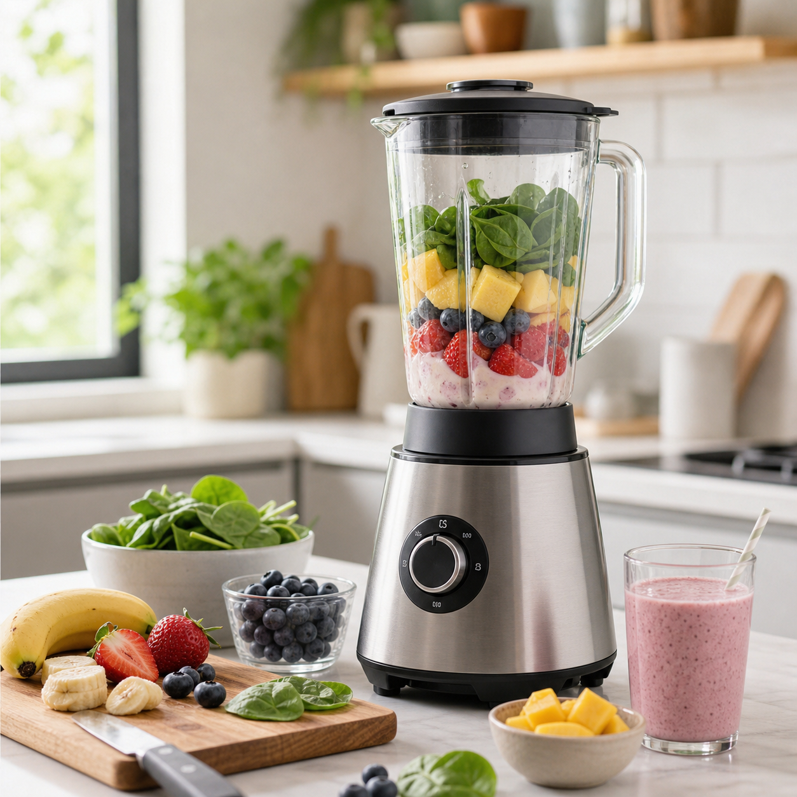

This home blender buying guide for smooth drinks is designed to help readers buy with purpose. A useful purchase solves a recurring problem, fits the available space, and feels easy enough to use on an ordinary weekday. A gift is more successful when it respects the recipient's tastes instead of treating alcohol-free choices as a compromise.

### Start with the use case

Picture the actual moment. Use modern blender with fruit, smoothie ingredients, and a clean kitchen counter as the product context, and ask whether the purchase is for a single serving, family breakfasts, quiet hosting, travel, or a celebration. A compact tool may suit an apartment kitchen. A larger pitcher or serving set may suit someone who hosts often. The right answer is shaped by habits, not by an impressive product description.

### What to compare

For equipment, compare capacity, dimensions, weight, noise, cleaning method, replacement parts, warranty terms, electrical compatibility, and storage. For food or drink gifts, compare ingredient lists, allergens, caffeine, sweetness, serving size, shelf life, shipping limits, and whether the recipient enjoys the flavor family. Read current retailer details at the time of purchase, since specifications and availability can change.

### A balanced budget

Set a spending limit before browsing. Allocate part of it to the item that does the main job, and keep room for a simple companion piece such as fresh citrus, a measuring tool, a recipe card, or a good glass. Avoid paying for features you will not use. A well-chosen basic item plus thoughtful presentation often feels more generous than a crowded box of novelty accessories.

### Gift presentation

Pair the item with an experience. A mocktail kit can include a handwritten menu for a quiet night in. A blender can come with a breakfast smoothie plan. A tea subscription can be wrapped with a favorite mug and a note about taking a slow afternoon. Those touches make the gift feel connected to a person rather than an abstract category.

### Safety and upkeep

Follow the manufacturer's cleaning and operating instructions. Wash produce before preparing drinks, refrigerate perishable ingredients promptly, and check that glassware, blades, cords, and lids remain in good condition. Do not make health promises based on a gadget, supplement, or beverage. Food choices and equipment can support a routine, while individual health needs call for qualified guidance.

### Questions readers ask

Should I choose a bundle? A bundle can work when every item has a clear purpose. Is a subscription a safe gift? It can be, once you confirm dietary preferences and delivery availability. How do I avoid duplicate tools? Ask what the recipient already uses, or choose consumable ingredients and a flexible recipe-focused addition.

### A purchase that lasts

The best choice earns repeat use. It makes a favorite drink easier to prepare, makes hosting more relaxed, or helps a recipient feel seen. That modest standard protects the budget and keeps the focus on something more satisfying than a flashy checkout page: a useful ritual that has a place in daily life.

### Small habits that improve every result

Set up before you mix, shop, or host. Put the items you will use on one clear surface, chill the drink components, and give yourself enough time to taste without rushing. Keep a notebook or phone note with the amount of citrus, sweetness, and dilution that pleased you. Those small records are useful when seasonal fruit changes or a favorite ingredient is unavailable.

### Plan around the people at the table

Offer water alongside any special drink, label pitchers when ingredients matter, and keep a low-sugar or caffeine-free option available where practical. A host does not need to explain anyone's choice. A warm welcome, a glass that feels considered, and a few flexible ingredients cover most occasions. When serving food, place drinks close to the moment they will be enjoyed; aroma, temperature, and bubbles all fade when a finished glass sits too long.

### Keep the routine realistic

Choose one small practice to repeat. It might be keeping citrus on hand, making a herb syrup on a quiet afternoon, setting out a favorite glass after work, or adding a new recipe to a shared meal plan. The value lies in ease and repetition. A drink, guide, gift, or question becomes more useful when it helps an ordinary moment feel cared for without adding pressure. Keep the approach flexible, and let curiosity guide each small adjustment.

Sources: FDA Food Safety for Consumers https://www.fda.gov/food/buy-store-serve-safe-food/food-safety-home USDA FoodData Central https://fdc.nal.usda.gov/
