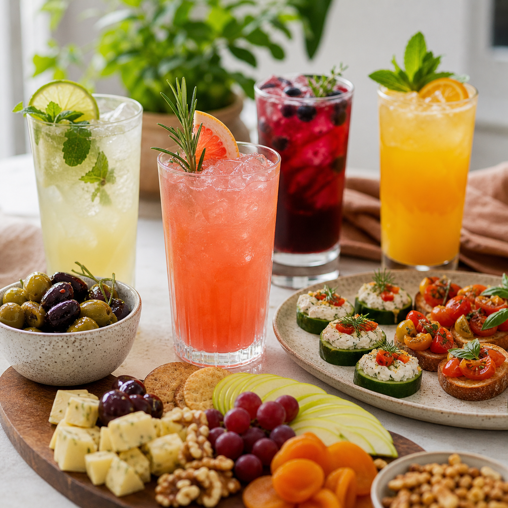

This mocktail food pairing guide for easy hosting gives readers a practical path from curiosity to confident choices. The point is not to collect more equipment or memorise a long list of rules. It is to understand the few decisions that shape flavor, texture, cost, and serving ease. Once those decisions are visible, a home drink routine feels far less mysterious.

### What this guide covers

Use colorful mocktails alongside small plates, fruit, cheese alternatives, and appetizers as the visual starting point, but focus on purpose. Ask what job each item does in the finished drink: sweetness, aroma, acidity, dilution, texture, temperature, or presentation. An item that performs two jobs is often more useful than a specialist tool that spends most of the year in a drawer.

### Core principle

Start with a flavor base, add a balancing element, and finish with a texture or aroma cue. A fruit puree may be the base. Citrus can bring lift. Cold tea, sparkling water, crushed ice, and fresh herbs can make the drink feel complete. Measure a few early attempts, write down what worked, and loosen the method once the balance feels familiar.

### A simple decision framework

Choose durable, easy-to-clean items for everyday use. Look for clear capacity marks on tools that measure liquid. Check whether a blender, juicer, or glass vessel is comfortable to lift and simple to rinse. For food products, read the ingredient list and nutrition panel, pay attention to added sugar, caffeine, allergens, and storage directions, and buy a small size before committing to a large package.

### Use it in real life

Build a modest setup around the drinks you already enjoy. A citrus press, jigger, long spoon, and fine strainer can cover a wide range of mocktails. A good tray of glasses and a few shelf-stable ingredients make hosting easier. For a more food-focused gathering, choose drinks with enough acidity to refresh the palate beside rich dishes and enough body to hold their own beside lighter plates.

### Common mistakes

Buying every trendy item at once creates clutter and does little for skill. Adding too many flavors can hide the ingredient you hoped to feature. Using warm sparkling water weakens the finish. Treating presentation as an afterthought can also make a carefully mixed drink feel unfinished. Keep the glass cold, use fresh garnish, and give the drink room for ice.

### Questions readers ask

Do I need professional barware? No. Start with accurate measuring and a vessel that pours cleanly. Can a guide work on a small budget? Yes. Build from multipurpose equipment and ingredients you will use in food as well as drinks. Is a more expensive ingredient always better? Not necessarily. Freshness, storage, and a good flavor match matter more than a prestige label.

### A useful way to keep learning

Make one variable change at a time. Switch the citrus, sweetener, or garnish and notice the difference. Keep favorites in a small notes file. That low-pressure practice creates a personal reference library, and it turns a drink guide into a habit you can use at breakfast, a quiet evening, or a full dinner table.

### Small habits that improve every result

Set up before you mix, shop, or host. Put the items you will use on one clear surface, chill the drink components, and give yourself enough time to taste without rushing. Keep a notebook or phone note with the amount of citrus, sweetness, and dilution that pleased you. Those small records are useful when seasonal fruit changes or a favorite ingredient is unavailable.

### Plan around the people at the table

Offer water alongside any special drink, label pitchers when ingredients matter, and keep a low-sugar or caffeine-free option available where practical. A host does not need to explain anyone's choice. A warm welcome, a glass that feels considered, and a few flexible ingredients cover most occasions. When serving food, place drinks close to the moment they will be enjoyed; aroma, temperature, and bubbles all fade when a finished glass sits too long.

### Keep the routine realistic

Choose one small practice to repeat. It might be keeping citrus on hand, making a herb syrup on a quiet afternoon, setting out a favorite glass after work, or adding a new recipe to a shared meal plan. The value lies in ease and repetition. A drink, guide, gift, or question becomes more useful when it helps an ordinary moment feel cared for without adding pressure. Keep the approach flexible, and let curiosity guide each small adjustment.

Sources: USDA FoodData Central https://fdc.nal.usda.gov/ FDA Food Safety for Consumers https://www.fda.gov/food/buy-store-serve-safe-food/food-safety-home
