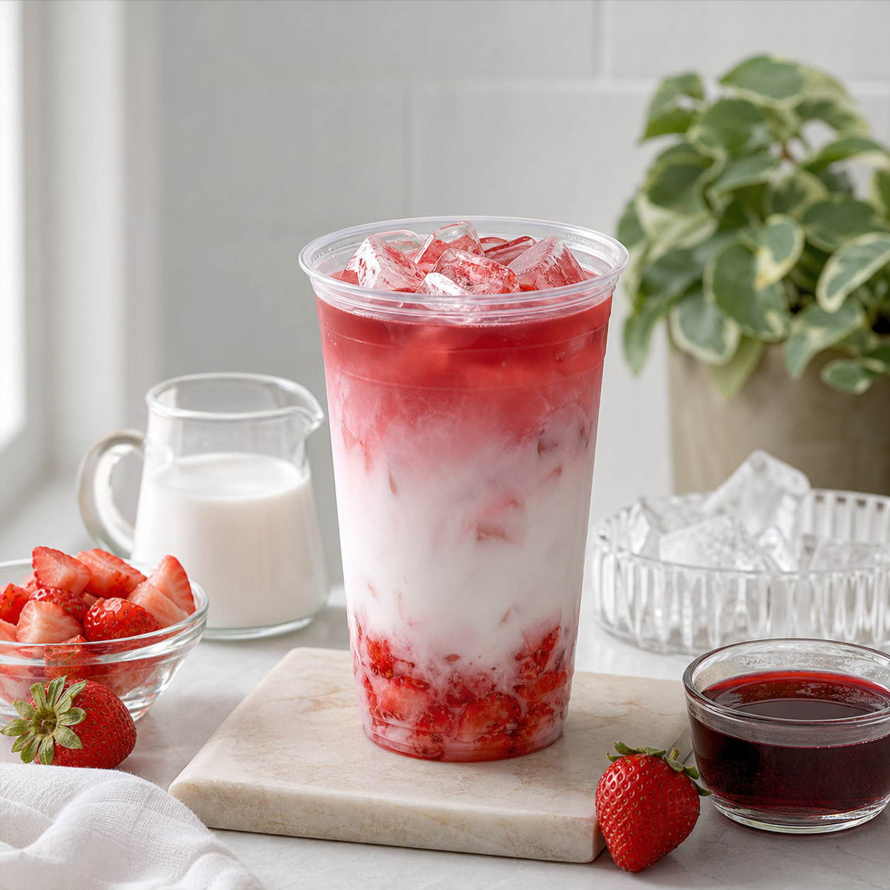

This pink drink copycat with coconut and strawberries is built for a real home kitchen: a short ingredient list, a clear method, and enough flexibility to make the drink feel personal. The goal is a glass that looks inviting while letting fresh produce, tea, bubbles, or dairy do the flavor work. Keep the sweetness gentle at the start. It is easy to add a little more; it is hard to take it away after mixing.

### Preparation details

Yield: 2 drinks. Active time: 10 minutes. Difficulty: easy. Equipment: a measuring cup, a spoon, a small knife, and two glasses. Nutrition changes with the amounts and brands used. A lighter build often uses fruit, unsweetened tea, sparkling water, and a modest amount of sweetener. Readers managing a health condition can tailor ingredients with a qualified clinician or dietitian.

### Ingredients

Set out coconut milk, strawberry pieces, berry tea, ice, and a clear reusable cup. Use cold ingredients where possible, and taste the fruit before adding sweetener. Ripe fruit brings a softer texture and a more rounded flavor. If an ingredient is unavailable, choose something in the same family: lemon can stand in for lime, frozen fruit can stand in for fresh fruit, and plain sparkling water can replace flavored water.

### Method

Chill the glasses with ice and prepare the garnish before mixing. Blend, muddle, or stir the flavor base until it tastes balanced on its own. Add the cold liquid and ice, leaving bubbles until the closing moment. Stir with a gentle lift from the base of the glass, rather than shaking sparkling drinks. Taste with a clean spoon and adjust with a squeeze of citrus, a splash of water, or a small amount of syrup.

### Serving notes

A good non-alcoholic drink needs contrast. Fruit offers aroma, citrus adds lift, bubbles create a celebratory feel, and herbs bring a clean finish. Use a tall glass for a long, refreshing drink or a stemmed glass when you want a dinner-table mood. A frozen fruit garnish can keep the drink cold while avoiding a watery finish.

### Make it your own

For a less sweet version, replace part of the juice or syrup with tea or sparkling water. For more body, use fruit puree, coconut milk, yogurt, or a blended banana where the style fits. For a party batch, mix the fruit, citrus, and sweetener in a pitcher; hold the ice and bubbles until guests are ready to pour.

### Troubleshooting

If the drink tastes flat, add a little citrus or a pinch of salt. If it tastes too sharp, use a small spoon of syrup or a splash of juice. If the glass looks cloudy, strain blended fruit through a fine sieve. If the bubbles vanish quickly, make sure the fizzy ingredient is cold and add it at the end.

### Common questions

Can this drink be made ahead? Prepare the flavor base a few hours ahead and refrigerate it. Add ice and sparkling ingredients only when serving. Is it suitable for children? The ingredient choices determine that answer. Read labels, use caffeine-free tea when appropriate, and consider individual dietary needs. How do I make it look polished? A clean rim, fresh garnish, and plenty of ice are more useful than elaborate equipment.

### Why this recipe belongs in a regular rotation

A repeatable alcohol-free drink gives everyday moments a small sense of occasion. It can sit beside dinner, replace a sweet afternoon beverage, or give guests a thoughtful option without making anyone explain their choice. Save the basic structure, change the fruit and herbs with the season, and the same approach can produce many distinct drinks.

### Small habits that improve every result

Set up before you mix, shop, or host. Put the items you will use on one clear surface, chill the drink components, and give yourself enough time to taste without rushing. Keep a notebook or phone note with the amount of citrus, sweetness, and dilution that pleased you. Those small records are useful when seasonal fruit changes or a favorite ingredient is unavailable.

### Plan around the people at the table

Offer water alongside any special drink, label pitchers when ingredients matter, and keep a low-sugar or caffeine-free option available where practical. A host does not need to explain anyone's choice. A warm welcome, a glass that feels considered, and a few flexible ingredients cover most occasions. When serving food, place drinks close to the moment they will be enjoyed; aroma, temperature, and bubbles all fade when a finished glass sits too long.

### Keep the routine realistic

Choose one small practice to repeat. It might be keeping citrus on hand, making a herb syrup on a quiet afternoon, setting out a favorite glass after work, or adding a new recipe to a shared meal plan. The value lies in ease and repetition. A drink, guide, gift, or question becomes more useful when it helps an ordinary moment feel cared for without adding pressure. Keep the approach flexible, and let curiosity guide each small adjustment.

Sources: USDA FoodData Central https://fdc.nal.usda.gov/ FDA Food Safety for Consumers https://www.fda.gov/food/buy-store-serve-safe-food/food-safety-home
