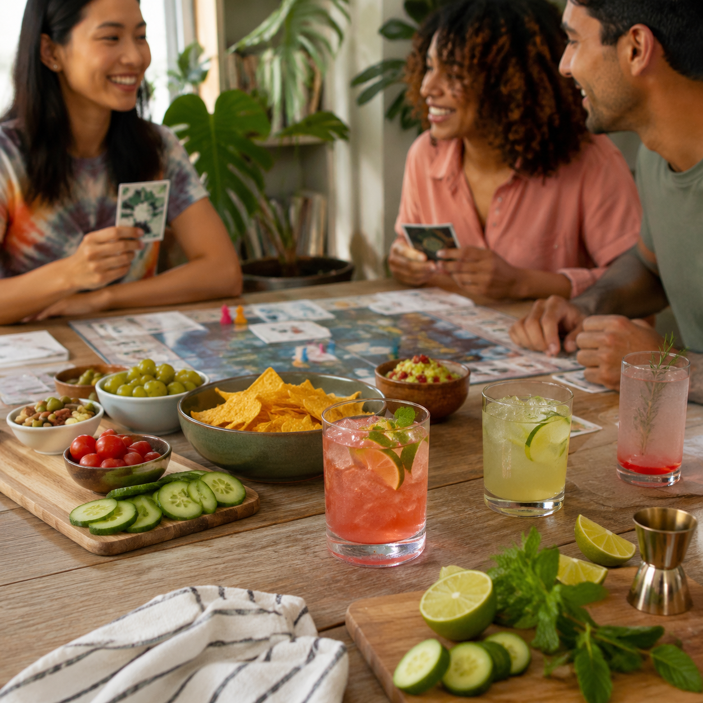

This sober curious game night ideas that feel social is about making room for choice, not performing perfection. A sober curious practice can be a one-night experiment, a season, a health conversation, or a lasting way to socialise. The useful question is simple: what would help this moment feel good without asking you to ignore your own needs?

### Start with your own reason

People take breaks from alcohol for many reasons, including sleep, training, medication, mood, budget, curiosity, or a desire for more intentional routines. You do not need a dramatic explanation to choose a non-alcoholic drink. A clear internal reason can make social decisions easier, even when you decide not to share the details with anyone else.

### A practical script

Short answers are often enough: "I am good with this tonight," "I am taking a break," or "I would love a sparkling drink." Say the sentence once, change the subject, and put attention back on the person in front of you. A colorful drink in hand can ease the social friction for some people, though it is never a requirement.

### Design the environment

Use friends playing tabletop games with mocktails and snack bowls to make the alcohol-free option feel deliberate rather than like an apology. Keep cold sparkling water, tea, fruit, herbs, and a favorite glass within easy reach. Tell a host in advance when that would make an event simpler. Invite a friend to join your plan when company helps. Build exits into your evening, such as your own ride or a reason to leave at a chosen time.

### When feelings show up

Changing a routine can bring relief, awkwardness, boredom, or a surprising sense of grief. Notice what situation creates the strongest pull: a particular time, place, person, or emotion. Add something supportive to that spot in the routine, such as food before an event, a walk, a text to a friend, a planned non-alcoholic drink, or a quieter social plan.

### Care and safety

This article is lifestyle education, not medical care. People who drink heavily or have experienced withdrawal symptoms should seek personalised medical advice before abruptly stopping. Support is available through clinicians, local health services, and recovery organisations. Asking for help is a practical safety step, not a failure of willpower.

### Questions to carry forward

What kind of social time leaves you feeling restored? Which rituals are worth keeping, even without alcohol? What would make a future invitation easier? Small answers add up. A routine that fits your real schedule is more likely to last than a strict plan built around someone else's idea of success.

### A gentler closing

The strongest alcohol-free life is not narrow. It can include dinner parties, concerts, holidays, a calm evening at home, and a drink that looks as festive as the occasion. Let the practice stay flexible, speak honestly about what helps, and keep adjusting as you learn more about what you want.

### Small habits that improve every result

Set up before you mix, shop, or host. Put the items you will use on one clear surface, chill the drink components, and give yourself enough time to taste without rushing. Keep a notebook or phone note with the amount of citrus, sweetness, and dilution that pleased you. Those small records are useful when seasonal fruit changes or a favorite ingredient is unavailable.

### Plan around the people at the table

Offer water alongside any special drink, label pitchers when ingredients matter, and keep a low-sugar or caffeine-free option available where practical. A host does not need to explain anyone's choice. A warm welcome, a glass that feels considered, and a few flexible ingredients cover most occasions. When serving food, place drinks close to the moment they will be enjoyed; aroma, temperature, and bubbles all fade when a finished glass sits too long.

### Keep the routine realistic

Choose one small practice to repeat. It might be keeping citrus on hand, making a herb syrup on a quiet afternoon, setting out a favorite glass after work, or adding a new recipe to a shared meal plan. The value lies in ease and repetition. A drink, guide, gift, or question becomes more useful when it helps an ordinary moment feel cared for without adding pressure. Keep the approach flexible, and let curiosity guide each small adjustment.

Sources: National Institute on Alcohol Abuse and Alcoholism https://www.niaaa.nih.gov/ Centers for Disease Control and Prevention Alcohol Use https://www.cdc.gov/alcohol/
